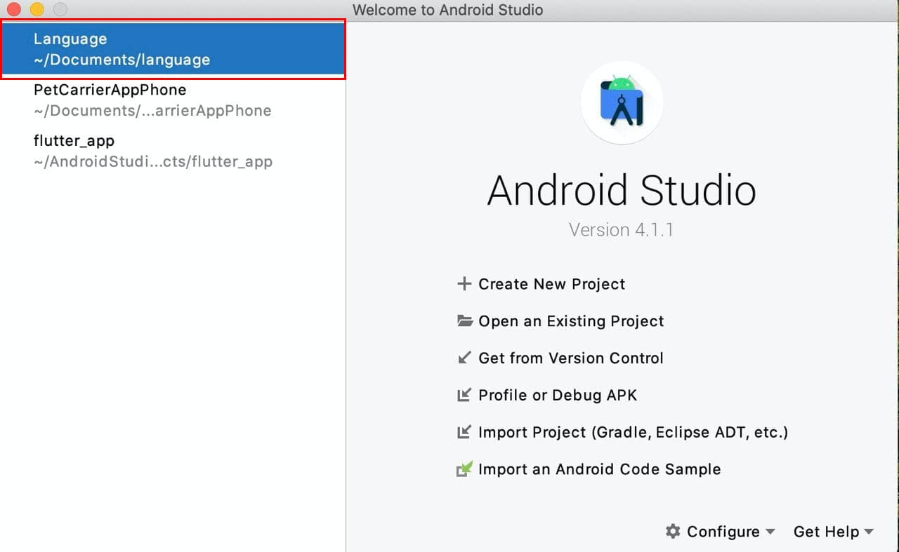
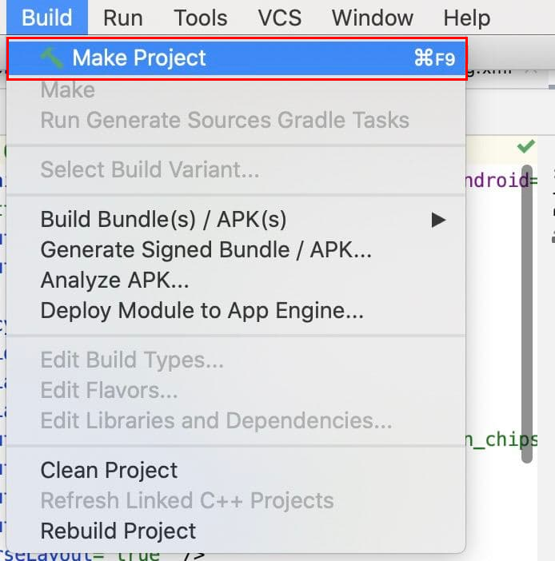
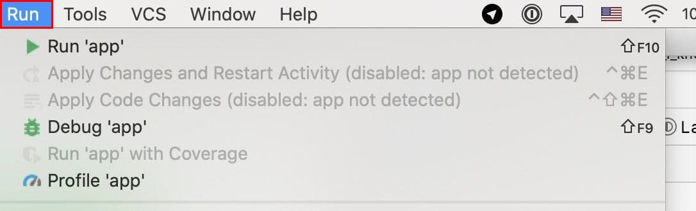
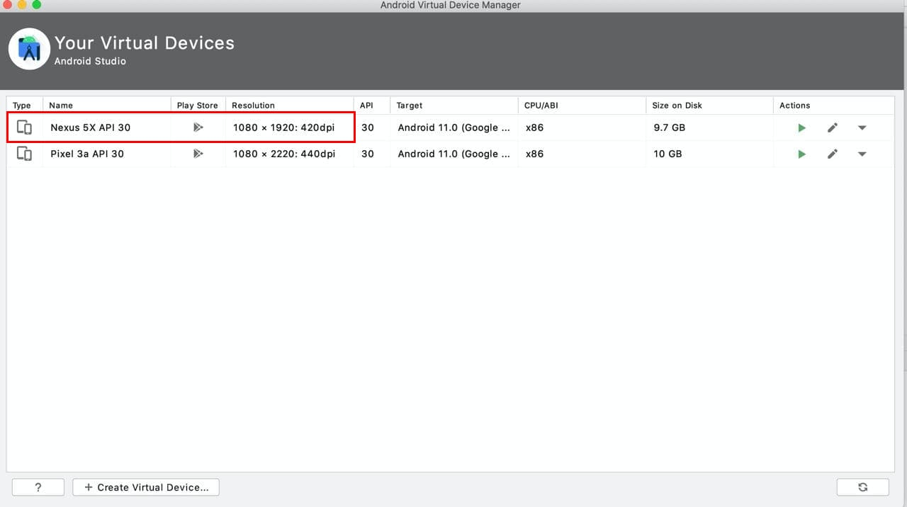
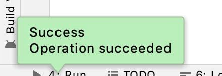
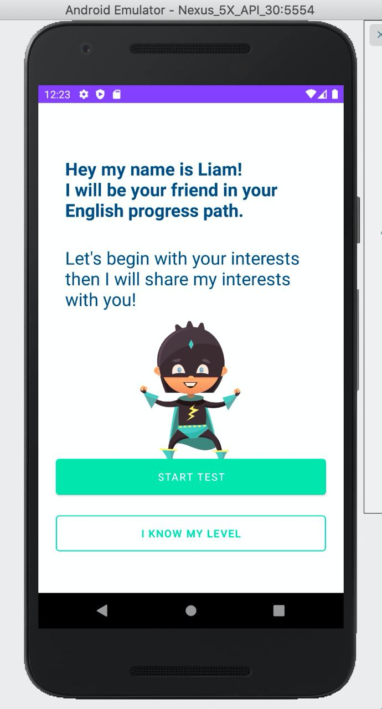

# English talk Android application

## Overview

This is an application for english talk and pronunciation on Android.
Inference is performed using the [english talk API](https://github.com/istanya/english_talk). 

These instructions walk you through building and running the demo on an Android
device. 

## Requirements

*   Android Studio 4.1.1 (installed on a Linux, Mac or Windows machine)

*   Android device in
    [developer mode](https://developer.android.com/studio/debug/dev-options)
    with USB debugging enabled

*   USB cable (to connect Android device to your computer)

## Build and run

### Step 1. Clone the language source code

Clone the language GitHub repository to your computer to get the demo
application.

```
git clone https://github.com/OlesyaJ/language.git
```

Open the language source code in Android Studio. To do this, open Android
Studio and select `Open an existing project`.



### Step 2. Build the Android Studio project

Select `Build -> Make Project` and check that the project builds successfully.
You will need Android SDK configured in the settings. The `build.gradle` file will prompt you to download any missing
libraries.

You can change the build variant to whichever one you want to build and run—just
go to `Build > Select Build Variant` and select one from the drop-down menu. See
[configure product flavors in Android Studio](https://developer.android.com/studio/build/build-variants#product-flavors)
for more details.

The file `download.gradle` directs gradle to download the two models used in the
example, placing them into `assets`.




### Step 3. Install and run the app

Connect the Android device to the computer and be sure to approve any ADB
permission prompts that appear on your phone. Select `Run -> Run app.` Select
the deployment target in the connected devices to the device on which the app
will be installed. This will install the app on the device.









To test the app, open the app called `Language` on your device. When you run
the app the first time, the app will request permission to access the voice.
Re-installing the app may require you to uninstall the previous installations.
